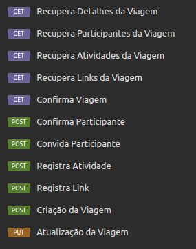

# Trilha JAVA - Next Level Week [NLW](https://www.rocketseat.com.br/eventos/nlw)
Este projeto foi desenvolvido durante um evento da plataforma [Rocketseat](https://app.rocketseat.com.br/) e foi ministrado pela ilustre [Fernanda Kipper](https://www.linkedin.com/in/fernanda-kipper/).

Este projeto é uma API RESTful desenvolvida em Java utilizando o framework Spring. A API serve como backend para um planejador de viagens, permitindo a criação, gestão e confirmação de viagens. Além disso, é possível convidar pessoas por email para participarem das viagens e adicionar atividades e links importantes relacionados a cada viagem.

## Tecnologias Utilizadas
-   **Java**
-   **Spring Framework**
-   **Banco de Dados em Memória (H2)**
-   **Maven**

## Endpoints
<div>
  
</div>

### GET

-   **`/trips/{id}`**: Lista todas as viagens.
-   **`/trips/{id}/confirm`**: Confirma a viagem.
-   **`/trips/{id}/participants`**: Lista todos os participantes de uma viagem.
-   **`/trips/{id}/activities`**: Lista todas as atividades de uma viagem.
-   **`/trips/{id}/links`**: Lista todos os links de uma viagem.

### POST
-   **`/trips`**: Cria uma nova viagem.
-   **`/trips/{id}/invite`**: Convida um usuário para a viagem.
-   **`/trips/{id}/activities`**: Adiciona uma nova atividade à viagem.
-   **`/trips/{id}/links`**: Adiciona um novo link à viagem.
- **`/participants/{id}/confirm`**: Confirma um participante na viagem.

### PUT
-   **`/trips/{id}`**: Atualiza uma viagem existente.


## Pré-requisitos

Para executar os códigos deste repositório, você precisará ter instalado:

- [Java JDK 8+](https://www.oracle.com/java/technologies/javase-jdk11-downloads.html)
- [Maven](https://maven.apache.org/download.cgi)
- Um IDE de sua escolha (por exemplo: o [IntelliJ IDEA](https://www.jetbrains.com/idea/) ou o [Eclipse](https://www.eclipse.org/))
- [Insomnia](https://insomnia.rest/download)

## Instalação

1. Clone o repositório para a sua máquina local:
    ```sh
    git clone https://github.com/seu-usuario/nlw-roketseat-java-trail.git
    ```
2. Navegue até o diretório do repositório:
    ```sh
    cd nlw-roketseat-java-trail
    ```
    
## Contribuição

Contribuições são bem-vindas! Se você quiser contribuir com este projeto, por favor siga estas etapas:

1. Faça um fork deste repositório.
2. Crie uma branch com a sua feature: `git checkout -b minha-feature`
3. Commit suas mudanças: `git commit -m 'Adicionar minha feature'`
4. Faça o push para a branch: `git push origin minha-feature`
5. Abra um Pull Request.

## Contato
Gostou do projeto?  
Tem uma sugestão, crítica ou elogio?  
Você pode me encontrar no Linkedin:  
  
  [](https://www.linkedin.com/in/galasso-matheus/)
